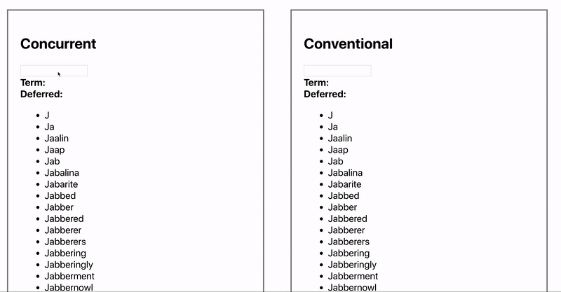

# React Concurrent Mode

Presentation and demo that investigates React's newly unveiled Concurrent Mode. Though still in a very experimental phase, it warrants a look to understand the feature-set and how React will fundamentally shift in the future.

Try the [interactive demo](https://willvedd.github.io/react-concurrent-mode)



## Demo

Demo is based off of [create-react-app](https://github.com/facebook/create-react-app) starter project.

The [interactive demo is available online](https://willvedd.github.io/react-concurrent-mode), but to run the demo locally:

```bash
cd demo
npm install #or yarn
npm run start #or yarn start
```

## Presentation

Presentation is a markdown file that usese [Deckset](https://www.deckset.com/) to render onscreen.

[View presentation slides here](https://github.com/willvedd/react-concurrent-mode/blob/master/presentation/presentation--short.md)

## Contact

If there are any errors with the demos or presentation, _please_ make a github issue or reach out to me!
