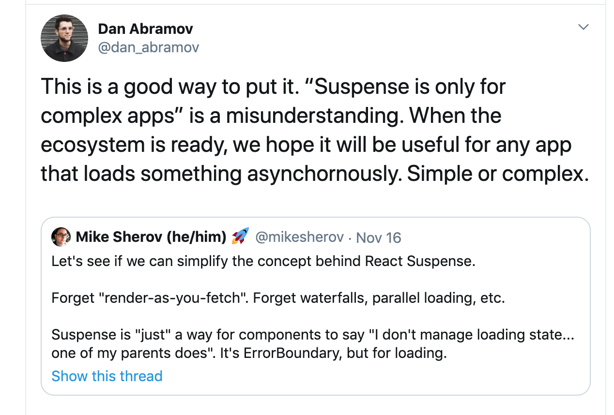
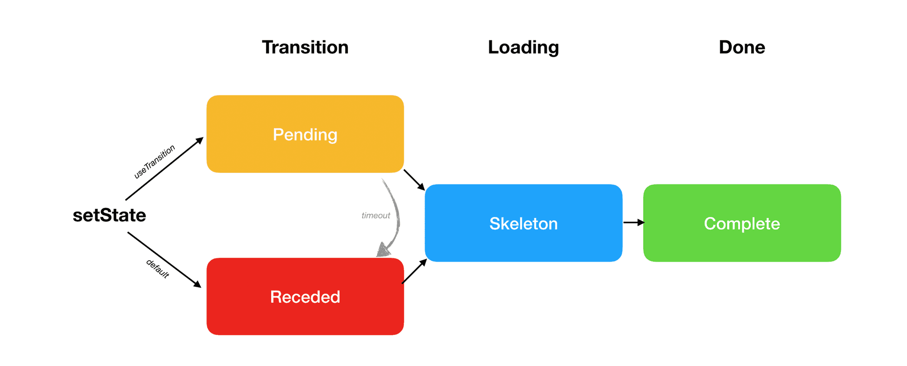
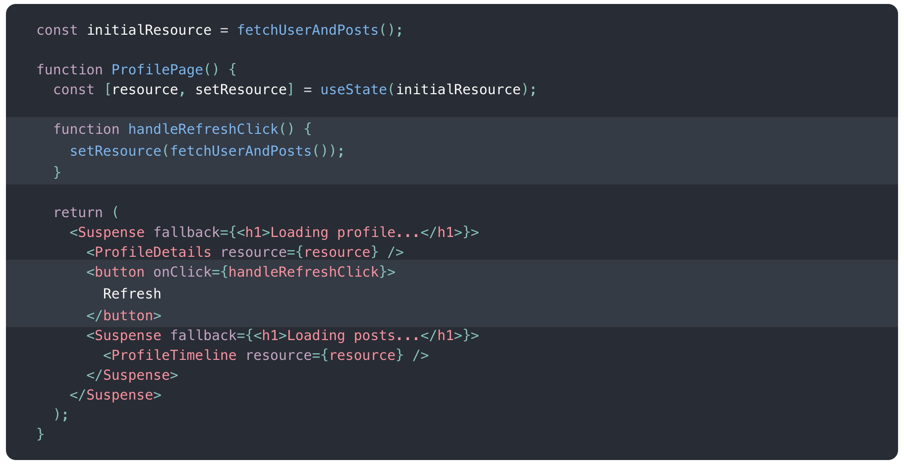
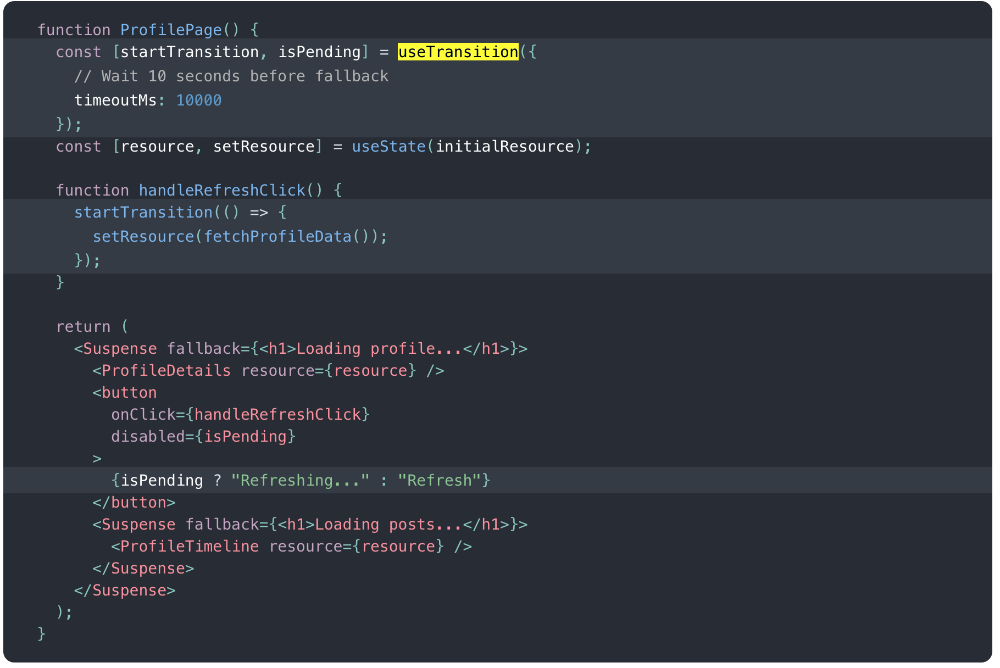
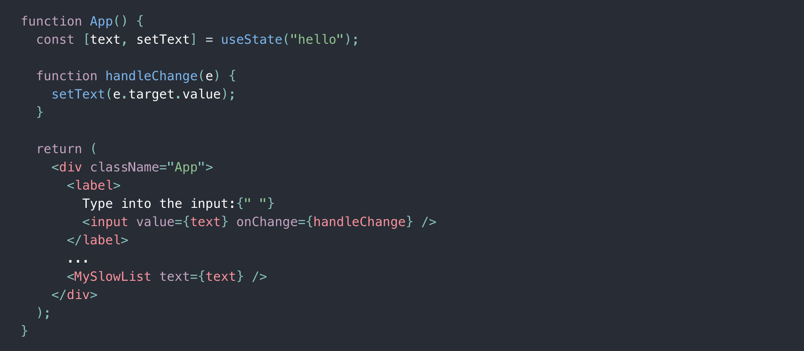
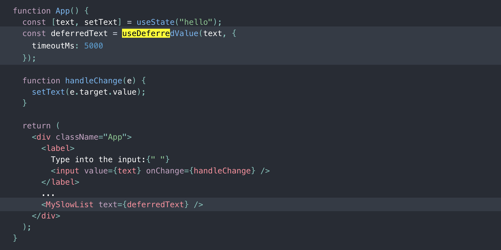
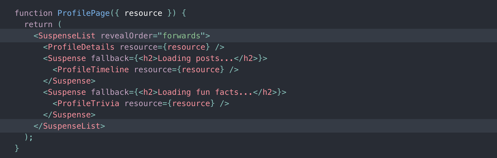

# React Concurrent Mode

---

# ?

---

# Concurrent Mode

- Announced about a year ago at ReactConf
- Public experimental release recently
- Lots of buzz in the React world for the last month
- Cause of Twitter arguments, confusion, excitement

---



---

"Concurrent Mode is a set of new features that help React apps stay responsive and gracefully adjust to the user’s device capabilities and network speed."

---

# Inspired by UX research

- Too many loading states, spinners between state-changes
- Keeping content on page >> loader
- Users expect text-inputs and hover to be fast
- Clicks and transitions forgiving if little slower

---

## Blocking vs interruptible rendering

---

## Blocking rendering

- Current rendering approach
- Once rendering begins, doesn't stop
- "Blocking rendering"
- Analogy: before version control

---

## Interruptible rendering

- Concurrent mode rendering approach
- Once rendering begins, parts can be "interupted"
- Analogy: version control, multiple branches
- Unlocks enhanced rendering techniques

---

## Hypothetical

- Auto-complete text input
- Interacts w/ expensive API
- Sluggish as you type
- What are some techniques?

---

## Hypothetical solutions?

- Debounce (fetch after keystrokes idle a set time)
- Throttle (limit frequency of data fetching)
- Consider
  - slow devices (mobile, older laptops)
  - slow network (Amtrak wifi, poor cell connection)

---

# Concurrent Mode

- This is where concurrent mode shines
- Features that help you orchestrate loading states => better UX
- Changes the way you think of ansychronous tasks in React
- Different paradigm, definite learning curve

---

## Features:

- <Suspense/>
- useTransition
- useDeferredValue
- <SuspenseList/>

---

## Installation:

`npm install react@experimental react-dom@experimental`

`ReactDOM.createRoot(document.getElementById("root")).render(<App/>)`

---

## <Suspense>

- Built-in primitive for handling loading states and "boundaries"
- Much like error boundaries
- Catches _suspended_ components
- Fallback component during suspension (loading)

---

## <Suspense>

```
<Suspense fallback={<Loader />}>
    <User data={quickAPIRequest()} />
    <Posts data={slowAPIRequest()} />
</Suspense>
```

---

# Suspension (concept)

- Components can be put in a "suspended" state during asyncrhonous operation
- API request, expensive sort, etc.
- Works by _throwing a promise_ (mechanics not too important)
- `fetch()` unsupported without plumbing
- Bubbles up like an error
- Inspired by algebraic effect

---

# When React is facing suspension:

- React will always try to find the most "complete" skeleton state.
- Render updates in batches on a schedule
- Will only show transition state as long as it needs to

---

# Three Phases of Rendering



---

# useTransition

- New hook
- Allows "old" content to exist during suspension
- Prevents flickering loading states
- Developer defines timeout, React will fallback to loader if exceeded
- Returns function and pending state boolean

---



---



---

# Demo

[https://codesandbox.io/s/sleepy-field-mohzb](useTransition demo)

---

# useDeferredValue

- Get the _currently deferred_ state value
- "Splitting" the state
- Useful for delaying fetches and janky renders

---



---



---

# Demo

[https://codesandbox.io/s/vigorous-keller-3ed2b](useDeferredValue demo)

---

# When React is facing suspension:

- React will always try to find the most "complete" skeleton state.
- Render updates in batches on a schedule
- Will only show transition state as long as it needs to

---

# Three Phases of Rendering


---

# When React is facing suspension:

React will do its best to not show loading states and flickering jank by deferring to old content, but not for too long

---

# <SuspenseList>

- Allows to orchestrate adjacent <Suspense>
- Prevents jumping of page and losing scroll location as things load
- Ordering customizable

---

# <SuspenseList>



---

# Personal Demo

---

## How it impacts devs

- Should start to consider:
  - Loading states (easy)
  - Decide what data is essential, what can be deferred (intermediate)
  - _Orchestrating_ loading states of various components at varying levels (hard)
  - Fine-tuning timeout and transition thresholds (intermediate)

---

# Personal Takeaways

- Arguably better for _fast_ APIs, lots of quick renders can casuse flickering
- <Suspense> in render blocking "legacy" mode is actually a nice drop-in, will become second nature
- Don't fully understand implementation, but excited to continue to learn

---

# Conclusion

- Concurrent mode isn't about making your apps faster\*
- More about tricking users into _thinking_ its faster
- These primitives and patterns offer tools to easily orchestrate loading states
- Don't need to adopt right now, but you should in the future

---


<!-- ---

- Arguably better for _fast_ APIs, because those fetches resolve and cause that loading flicker, especially off an input where this rendering cycle can happen several times per second. Slower APIs seem to get "rolled into" a deferred render and cause less flickering (if that makes any sense)

- Slow network requests aren't as important as the code speed assuming those requests are asyncronously (which react and JS make it really hard to be syncrhonous and render-blocking by default). Slow code is where I've been able to force components to suspend the easiest.

- Using <Suspense> in the render blocking `ReactDOM.render()` function is actually very drop-in for experimental versions of react. Furthermore it's a welcomed primitive that will create more declarative and consistent code.

- Concurrent mode isn't about making React _faster_ necessarily. Although there may be some modest performance improvements by rendering immediately rather than defering rendering, these improvements are still marginal and likely unnoticeable in most cases (or so I would imagine _shrug_). Concurrent mode is more about tricking your users into thinking your app is faster with some UX/Psychology tricks.

  - Example: instead of relying on debounce and throttling (thereby delaying requests and render) strategies to limit flicker, let these new react features handle these jarring loading states. It's an automatic performance boost!

- Concurrent depends on executing asynchronous tasks by _throwing a promise_. Let that sink in, it's weird at first. I suppose that's the only dependable way of bubbling up the existence of network requests and slow code. This was much harder to wrap my mind around than the concurrent API itself. The idea is that this is merely an implementation detail and will disappear under the hood once popular libraries adopt these conventions to be compatible with the new featureset. But in practice, I had lots of issues executing basic network requests. If you want to be concurrent-compatible, you won't be able to do a simple `fetch` anymore.
  - Lots of cryptic errors, stacktraces with the occasional infinite-loop error which crashed the browser tab
  - Looking forward to React offering a _practical_ approach to fetching data
  - Hope this isn't React and Facebook bullying JS specs standards
  - This was inspired by the idea of ["Algebraic effects"](https://overreacted.io/algebraic-effects-for-the-rest-of-us/) which is basically a method of "bubbling up" effects to defer to a later point by some parent component, but doesn't need to be known by an intermediate parent component

* I still don't understand much of the implementation but I'm still interested in learning how concurrent mode doesn't create an inconsistent render, because you could potentially be rendering several different "threads" and depending on the environment (user device, internet speed, API performance), different users may experience different renders. One thing I love about react is that the UI is just a function of state. It's still essentially a function of state but not necessarily over time.

* Interesting that they're providing developers with timeout configurations in the `useDeferredValue` and `useTransition`. In my usage, I found that low thresholds ~<500ms yielded intermittent console errors about suspensions not being caught, 750ms was an effective minimum
  - Not certain if my errors are a bug?
  - Wondering if React team or community will suggest "best" practices for honing in on a number
  - React team also mentions that "React will always try to use a shorter lag when network and device allows it", but is not clear about what this means. That seems out of the concern of React
  - This configuration is very un-Reactlike and wonder if it sticks

- Day-to-day implications
  - Need to think and be intentional about:
    - loading states (easy)
    - What things you want to show before data is ready (intermediate)
    - How you want to _orchestrate_ loading states of various components at varying levels and how much (hard)
    - Fine-tuning timeout and transition thresholds (intermediate) -->

---

<!-- ## Concurrent rendering recap

- Reduced need for debounce and throttle
- Don't need to _delay_ rendering
- Rendering can start right away in memory,

Concurrent Mode techniques reduce the need for debouncing and throttling in UI. Because rendering is interruptible, React doesn’t need to artificially delay work to avoid stutter. It can start rendering right away, but interrupt this work when needed to keep the app responsive. -->

<!-- ---

Demo Issues:

- Coming up with examples = hard
  - Solves Rare problems
  - Web apps of huge scale (Facebook)
- Relies on slow code, slow devices
- Throwing promises = weird concept, hacky
- No "real world" examples yet -->
